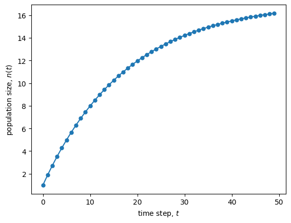
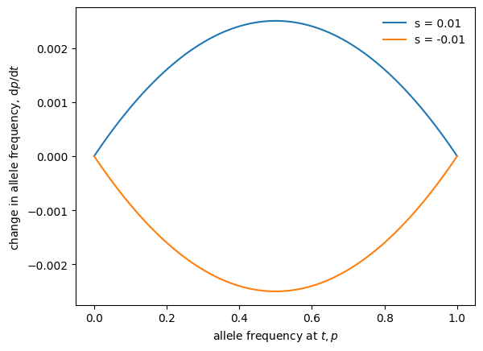

<link rel="stylesheet" href="https://unpkg.com/thebe@latest/lib/thebe.css">

# Lecture 2: Numerical and graphical techniques (univariate)

	Run notes interactively?
	

	

## Lecture overview

1. [Plots of variables over time](#section1)
2. [Plots of variables as a function of themselves](#section2)
3. [Summary](#section3)

Before we jump into more rigorous mathematical analyses, we’re first going to learn how to get a feel for the dynamics of our models.

To do so we’re going to choose some particular numerical values for our parameters and then use our models to predict what happens over time.

The downside of this approach is that we often won’t know the parameter values to choose and, regardless, choosing particular values doesn’t tell us about the dynamics of our model more generally.

The upside is that this approach can highlight errors or reveal unexpected patterns that guide future mathematical analyses.

## 1. Plots of variables over time

We've already seen two examples of this in the previous lecture. Let's repeat the discrete-time migration example step by step.

We first write a recursive function (actually, a "generator" in Python) to generate values of the population size, $n(t)$, at sequential time points, $t$.

<pre data-executable="true" data-language="python">
def discrete_model(n0, b, d, m, tmax):
    '''define generator for population size'''
    
    # set initial values
    t,n=0,n0
    
    # yield new values
    while t < tmax:
        yield t,n
        
        # update values
        t += 1
        n = (n + m) * (1 + b - d - b*d) #the recursion equation we derived above
</pre>

We then chose some **parameter values** ($b$, $d$, $m$) and **initial conditions** (initial population size, $n(0) = 1$) to get the values of $n(t)$ from the initial ($t = 0$) to final (tmax) time.

<pre data-executable="true" data-language="python">
import numpy as np
tn = discrete_model(n0=1, b=0.05, d=0.1, m=1, tmax=50) #choose some parameter values and initial conditions
tns = np.array([vals for vals in tn]) #get all the t, n(t) values
</pre>

And we then plot $n(t)$ as a function of $t$.

<pre data-executable="true" data-language="python">
import matplotlib.pyplot as plt
fig, ax = plt.subplots()
ax.plot(tns[:,0], tns[:,1], marker = '.', markersize = 10)
ax.set_xlabel('time step, $t$')
ax.set_ylabel('population size, $n(t)$')
plt.show()
</pre>

    

    

We can use this technique to, say, compare different rates of migration.

<pre data-executable="true" data-language="python">
fig, ax = plt.subplots()
for i, m in enumerate([0,1,2]):
    tn = discrete_model(n0=1, b=0.05, d=0.1, m=m, tmax=50)
    tns = np.array([vals for vals in tn])
    ax.plot(tns[:,0], tns[:,1], label=f"m = {m}", marker = '.', markersize = 10)

ax.set_xlabel('time step, $t$')
ax.set_ylabel('population size, $n(t)$')
ax.legend()
plt.show()
</pre>

    

    

## 2. Plots of variables as a function of themselves

OK, so now we’ll move on to a plot that is easier to generate and is very useful for models with just one variable (which is what we’ve been working with so far).

Instead of plotting the variable as a function of time, we’ll plot the variable as a function of the variable in the previous time, e.g., plotting $n(t+1)$ as a function of $n(t)$. We could do this for the model above but let's move on to something else for variety.

### Haploid selection

Consider a population with two types of individuals, $n_A(t)$ with allele $A$ and $n_a(t)$ with allele $a$. The frequency of $A$ in the population is $p(t) = \frac{n_a(t)}{n_A(t) + n_a(t)}$. This is the variable we wish to track.

Let’s assume that each individual with an $A$ leaves $W_A$ descendants in the next generation and each individual with an $a$ leaves $W_a$ descendants.
These $W_i$ are referred to as the **absolute fitnesses** as they determine the (absolute) numbers of individuals with a $A$ and a $a$ in the next generation, $n_i(t+1) = W_i n_i(t)$, for $i=A$ and $i=a$. The frequency of $A$ in the next generation is then

$$
\begin{aligned}
p(t+1) 
&= \frac{W_A n_A(t)}{W_A n_A(t) + W_a n_a(t)} \\
&= \frac{W_A\frac{n_A(t)}{n_A(t) + n_a(t)}}{W_A\frac{n_A(t)}{n_A(t) + n_a(t)} + W_a\frac{n_a(t)}{n_A(t) + n_a(t)}}\\
&= \frac{W_A p(t)}{W_A p(t) + W_a (1-p(t))}.
\end{aligned}
$$

This is the recursion equation we want to plot. Below is some code that plots $p(t+1)$ as a function of $p(t)$.

<pre data-executable="true" data-language="python">
import sympy

# Build cobweb plotting function
def cobweb_haploid(p0, WA, Wa, max=np.inf):
    t, pnow, pnext = 0, p0, 0 #initial conditions
    while t <= max:
        yield pnow, pnext #current value of p(t) and p_(t+1)
        pnext = (WA * pnow) / (WA * pnow + Wa * (1 - pnow)) #update p_(t+1)
        yield pnow, pnext #current value of p(t) and p_(t+1)
        pnow = pnext #update p(t)
        t += 1 #update t
        
# Build function for generating figure
def plot_haploid_selection(WA, Wa, p0=0.5, ax=None):
    pt = sympy.symbols('pt') #define our variable p(t)

    # Write out sympy equation
    f = (WA * pt) / (WA * pt + Wa * (1 - pt)) #the recursion equation

    # Compute function over a set of points in [0,1] by 'lambdifying' sympy equation (turn it into a function)
    t = np.linspace(0,1,100)
    fy = sympy.lambdify(pt, f)(t)

    # Build plot
    if ax == None:
        fig, ax = plt.subplots()
    ax.plot(t, fy, color='black', label=f"$W_A$ = {WA}, $W_a$ = {Wa}") #plot p_(t+1) as function of p(t)
    ax.plot(t, t, color='black', linestyle='--') #draw 1:1 line for reference
    
    # Add cobweb
    cobweb = np.array([p for p in cobweb_haploid(p0, WA, Wa, max=100)])
    ax.plot(cobweb[:,0], cobweb[:,1])
    
    # Annotate and label plot
    ax.set_xlim(0,1)
    ax.set_ylim(0,1)
    ax.set_xlabel("allele frequency at $t$, $p(t)$")
    ax.set_ylabel("allele frequency at $t+1$, $p(t+1)$")
    ax.legend(frameon=False)
    return ax
        
# Plot figure
fig, ax = plt.subplots(1,2)
fig.set_size_inches(12,4)

# First cobweb with WA > Wa
plot_haploid_selection(WA = 1, Wa = 0.5, ax=ax[0])

# Second cobweb with WA < Wa
plot_haploid_selection(WA = 0.5, Wa = 1, ax=ax[1])

plt.show()
</pre>

    

    

There are three components to this plot. First, the solid curve gives the recursion itself ($p(t+1)$ as a function of $p(t)$). Second, the dashed line shows where $p(t+1)=p(t)$. And third, the blue lines show how the variable changes over multiple time steps. 

Foreshadowing what is to come, the dashed line is helpful for two reasons. First, it indicates where the variable does not change over time. So wherever the recursion (solid line) intersects with the dashed line is an **equilibrium**. Second, it reflects $p(t+1)$ back onto $p(t)$, updating the variable. For example, in the left panel above we start with an allele frequency of $p(t)=0.5$, draw a blue vertical line to the recursion to find $p(t+1)$, and then update $p(t)$ to $p(t+1)$ by drawing the horizontal blue line to the dashed line. Now we can ask what $p(t+1)$ is given this updated value of $p(t)$ by drawing another vertical blue line, and so on. Following the blue line we can therefore see where the system is heading, which tells us about the **stability** of the equilibria. What are the stable equilibria in the two panels above?

We can do something very similar for difference and differential equations. Now we plot the **change** in the variable as a function of the current value of the variable, e.g., plot $\Delta n$ or $dn/dt$ as a function of $n(t)$.

For example, in continuous time the haploid selection model is

$$
\frac{\mathrm{d}p}{\mathrm{d}t} = sp(1-p)
$$

where $s=(W_A-W_a)/W_a$ is called the **selection coefficient** of $A$ relative to $a$. The plot of $dp/dt$ vs. $p$ is below.

<pre data-executable="true" data-language="python">
# Initialize sympy symbols
p0, s, t = sympy.symbols('p0, s, t')
p = sympy.Function('t')

# Specify differential equation
diffeq = sympy.Eq(p(t).diff(t), s * p(t) * (1 - p(t)))

# Convert differential equation RHS to pythonic function
dp = sympy.lambdify((s, p(t)), diffeq.rhs)

# Plot the curve
fig, ax = plt.subplots()

for s_coeff in [0.01, -0.01]:
    ax.plot(
        np.linspace(0, 1, 100),
        dp(s_coeff, np.linspace(0,1, 100)),
        label=f"s = {s_coeff}"
    )

ax.set_xlabel('allele frequency at $t, p$')
ax.set_ylabel('change in allele frequency, $\mathrm{d}p/\mathrm{d}t$')
ax.legend(frameon=False)
plt.show()
</pre>

    

    

What does this tell us about how allele frequency will change when $s>0$ vs. $s<0$? And what allele frequencies, $p$, cause more rapid evolution?

Now let's simplify the above plots and just indicate the direction (and magnitude) of change in $p(t)$ with time. This is known as a **phase-line diagram**.

<pre data-executable="true" data-language="python">
def phase_line_haploid(p0, WA, Wa, max=np.inf):
    'generator for p(t)'
    t, pnow, pnext = 0, p0, 0 #initial conditions
    while t < max:
        yield pnow #current value of p(t) and p_(t+1)
        pnext = (WA * pnow) / (WA * pnow + Wa * (1 - pnow))
        pnow = pnext #update p(t)
        t += 1 #update t

def plot_phase_line_haploid(WA, Wa, p0, max=20, ax=None):
    'plot phase line'
    
    # Set up figure
    if ax==None:
        fig, ax = plt.subplots()
        fig.set_size_inches(8,0.25)
    ax.axhline(0, color='black', linewidth=0.5)
    
    # Plot phase-line
    pts = [pt for pt in phase_line_haploid(p0, WA, Wa, max=max)] #pt values
    ax.plot(
        pts,
        np.zeros(max) #dummy y values (0 for all x values) because we want to plot a 1d line
    )
    
    # Plot vector field
    marker = '>' if pts[2] > pts[1] else '<' #determine which direction to point based on first 2 time points
    ax.scatter(
        pts,
        np.zeros(max),#dummy y again
        marker=marker, s=150
    )
    
    # Remove background axes
    ax.set_ylabel('$p$', rotation=0)
    ax.set_xlabel(f"$W_A$ = {WA}, $W_a$ = {Wa}, $p_0$ = {p0}")
    ax.get_yaxis().set_ticks([])
    ax.spines['top'].set_visible(False)
    ax.spines['right'].set_visible(False)
    ax.spines['bottom'].set_visible(False)
    ax.spines['left'].set_visible(False)
    ax.set_xlim(0,1)
    plt.show()
    
plot_phase_line_haploid(WA=1, Wa=0.5, p0=0.01)

plot_phase_line_haploid(WA=0.5, Wa=1, p0=0.99)
</pre>

    

    

    

    

As above, we see the frequency of $A$ approaches $p=1$ when $W_A>W_a$ (i.e., $s>0$) and $p=0$ when $W_a>W_A$ (i.e., $s<0$). We also notice, as above, the changes are fastest (fewer, longer arrows) at intermediate frequencies.

## 3. Summary

To get a feel for a model it is helpful to plot some numerical examples:

- plot the variable as a function of time ("simulate")
- plot the variable (or change in variable) as a function of itself
