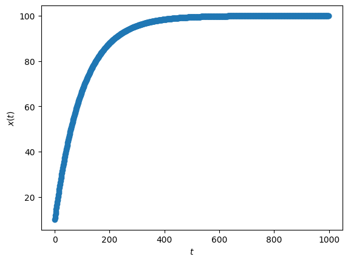
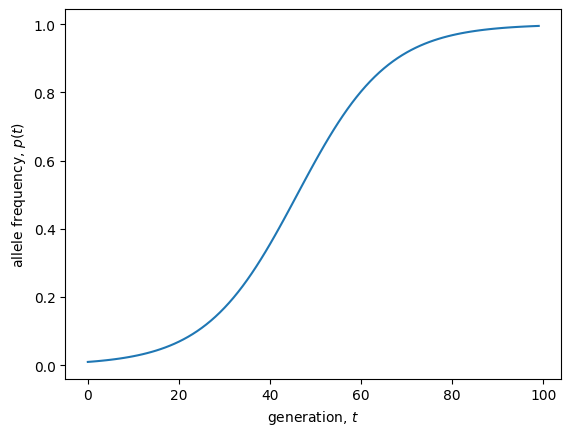

<link rel="stylesheet" href="https://unpkg.com/thebe@latest/lib/thebe.css">

# Lecture 5: General solutions (univariate)

	Run notes interactively?
	

	

## Lecture overview

1. [General solutions](#section1)
2. [Example: haploid selection](#section2)
3. [Summary](#section3)

## 1. General solutions

Equilibria and their stability describe the *long-term dynamics* of our models, i.e., what we expect after a long time has passed. Now we’ll look at some  cases where we can describe the *entire* dynamics, including the short-term, by solving for the variable as a function of time, $x(t) = f(t)$. This is called a **general solution**.

### Linear models in discrete time

With a single variable, $x$, a discrete time **linear model** can be written 

$$
x(t+1) = a x(t) + b.
$$

For example, this could be our previous model of population growth with immigration.

The general solution can be found with the following steps.

**Step 1**: Solve for the equilibrium,

$$
\begin{aligned}
\hat{x} &= a \hat{x} + b \\
\hat{x} &= \frac{b}{1 - a}.
\end{aligned}
$$

!!! note
   
    Note that if $a=1$ there is no equilibrium for $b\neq0$ and instead you can use brute force iteration (see below) to show that $x(t) = x_0 + b t$.

**Step 2**: Define $\delta(t) = x(t) - \hat{x}$, the deviation of our variable from the equilibrium (this is our transformation).

**Step 3**: Write the recursion equation for the transformed variable,

$$
\begin{aligned}
\delta(t+1) &= x(t+1) - \hat{x} \\
&= a x(t) + b - \hat{x} \\
&= a(\delta(t) + \hat{x}) + b - \hat{x}\\
&= a \left(\delta(t) + \frac{b}{1 - a}\right) + b - \frac{b}{1 - a}\\
&= a \delta(t).
\end{aligned}
$$

This is, once again, exponential growth.

**Step 4**: From this we can use **brute force iteration** to get the general solution for the deviation from equilibrium,

$$
\begin{aligned}
\delta(t) &= a \delta(t-1)\\
&= a^2 \delta(t-2)\\
&= a^3 \delta(t-3)\\ 
&\vdots\\
&= a^t \delta(0).
\end{aligned}
$$   

**Step 5**: Reverse transform back to $x(t)$,

$$
\begin{aligned}
x(t) &= \delta(t) + \hat{x}\\
&= a^t \delta(0) + \hat{x}\\
&= a^t (x(0) - \hat{x}) + \hat{x}\\
&= a^t x(0) + (1 - a^t)\hat{x}.
\end{aligned}
$$

This says that our variable moves from $x(0)$ towards/away from $\hat{x}$ by a factor $a$ per time step. Note that if $b=0$ then $\hat{x}=0$ and this reduces to what we derived above, $x(t)=a^t x(0)$.

Below we plot the general solution for a given value of $a$ and $b$ from a number of different intitial conditions. Try playing with the values of $a$ and $b$ and observe the different dynamics.

<pre data-executable="true" data-language="python">
a, b, x0 = 0.99, 1, 10 #define parameter values and initial condition
ts = range(1000) #time values
xs = [a**t * x0 + (1-a**t)*b/(1-a) for t in ts] #variable values from general solution
plt.scatter(ts, xs) #plot discretely
plt.ylabel('$x(t)$')
plt.xlabel('$t$')
plt.show()
</pre>

    

    

### Separation of variables in continuous time

Consider the generic continuous time model,

$$
\frac{\mathrm{d}x}{\mathrm{d}t} = f(x,t),
$$

where we've allowed the right-hand side to depend on time explicitly (eg, time lags, environmental change).

We will try to get the general solution for $x(t)$ using a method called **separation of variables**. This will only work if we can write the right hand side as $f(x)=g(x)h(t)$, ie, if we can separate the variables, $x$ and $t$. If we can then

$$
\begin{aligned}
\frac{\mathrm{d}x}{\mathrm{d}t} &= g(x)h(t)\\
\frac{\mathrm{d}x}{g(x)} &= h(t)\mathrm{d}t\\
\int\frac{\mathrm{d}x}{g(x)} &= \int h(t)\mathrm{d}t.
\end{aligned}
$$

If we can solve these integrals then we get a general solution. In this class we will typically not have explicit time dependence, ie, $h(t)$ is a constant. Then the right-hand integral is just the constant times $t$ and a general solution is limited by our ability to integrate $1/g(x)$.

## 2. Example: haploid selection

To see an example of separation of variables, consider our model of haploid selection in continuous time. The frequency of the $A$ allele changes at a rate that depends on its selection coefficient, $s$, and the amount of genetic variance in the population, $p(1-p)$,

$$
\frac{\mathrm{d}p}{\mathrm{d}t} = sp(1-p).
$$

Grouping the $p$ terms together, we can proceed with the above steps using $g(p)=p(1-p)$ and $h(t)=s$,

$$
\begin{aligned}
\int\frac{\mathrm{d}p}{g(p)} &= \int h(t)\mathrm{d}t\\
\int\frac{\mathrm{d}p}{p(1-p)} &= \int s\mathrm{d}t\\
\int \left(\frac{1}{p} + \frac{1}{1-p}\right) \mathrm{d}p &= \int s\mathrm{d}t \;\text{(method of partial fractions, rule A1.9 in the textbook)}\\
\ln(p) - \ln(1 - p) + c_1 &= s t + c_2 \;\text{(rule A2.21 in the textbook)}\\
\ln\left(\frac{p}{1-p}\right) &= s t + c \; \text{(where } c = c_2 - c_1\text{)}\\
\frac{p}{1-p} &= \exp(st + c)\\
\frac{p(t)}{1-p(t)} &= \exp(st + c)\; \text{(just making the dependence on time explicit)}.
\end{aligned}
$$

Note that we were careful to include the essential integration constants, $c_1$ and $c_2$, which we combined into one unknown constant, $c$. We can replace $c$ with the value of $p$ at some $t$. We typically choose $t=0$, rewriting $c$ in terms of the initial condition $p(0)$. Setting $t=0$ we have,

$$
\begin{aligned}
\frac{p(t)}{1-p(t)} &= \exp(st + c) \\
\frac{p(0)}{1-p(0)} &= \exp(c).
\end{aligned}
$$

Now using this to replace $c$,

$$
\begin{aligned}
\frac{p(t)}{1-p(t)} &= \exp(st + c) \\
\frac{p(t)}{1-p(t)} &= \exp(st)\exp(c) \\
\frac{p(t)}{1-p(t)} &= \exp(st)\frac{p(0)}{1-p(0)}.
\end{aligned}
$$

And finally we solve for $p(t)$,

$$
\begin{aligned}
\frac{p(t)}{1-p(t)} &= \exp(st)\frac{p(0)}{1-p(0)} \\
p(t) &= (1-p(t))\exp(st)\frac{p(0)}{1-p(0)} \\ 
p(t) &= \exp(st)\frac{p(0)}{1-p(0)} - p(t)\exp(st)\frac{p(0)}{1-p(0)} \\
p(t) + p(t)\exp(st)\frac{p(0)}{1-p(0)} &= \exp(st)\frac{p(0)}{1-p(0)} \\
p(t)\left(1 + \exp(st)\frac{p(0)}{1-p(0)}\right) &= \exp(st)\frac{p(0)}{1-p(0)} \\
p(t) &= \frac{\exp(st)\frac{p(0)}{1-p(0)}}{1 + \exp(st)\frac{p(0)}{1-p(0)}} \\
p(t) &= \frac{1}{1 + \exp(-st)\frac{1-p(0)}{p(0)}}.
\end{aligned}
$$

This is a very classic result in population genetics, which we plot below for an initially rare and beneficial allele A that sweeps to fixation. 

<pre data-executable="true" data-language="python">
import numpy as np
import matplotlib.pyplot as plt

s, p0 = 0.1, 0.01 #define parameter values and initial condition
ts = range(100) #time values
ps = [1/(1 + np.exp(-s*t)*(1-p0)/p0) for t in ts] #variable values from general solution

plt.plot(ts, ps) #plot continuously
plt.ylabel('allele frequency, $p(t)$')
plt.xlabel('generation, $t$')
plt.show()
</pre>

    

    

## 3. Summary

We can sometimes solve for the entire dynamics of our variables, the ultimate solution.

- for linear discrete-time models, we can always do this with a transformation and brute force integration 
- for continuous-time models, we can sometimes do this with separation of variables

Unfortunately most models we encounter in research are too complex to solve for exactly. We then often rely on equilibria, stability, and simulations. 
