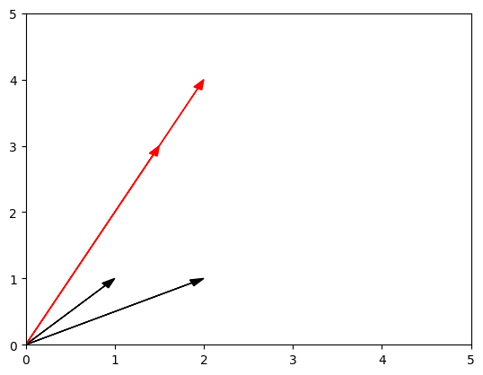
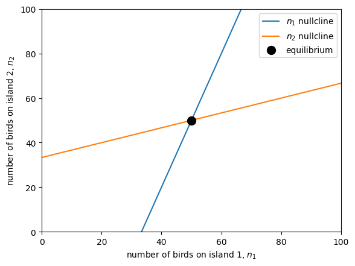

<link rel="stylesheet" href="https://unpkg.com/thebe@latest/lib/thebe.css">

# Lecture 7: Finding equilibria in linear multivariate models 

	Run notes interactively?
	

	

## Lecture overview

1. [Motivation](#section1)
2. [Matrix inversion](#section2)
3. [Solving for equilibrium](#section3)
4. [Summary](#section4)

## 1. Motivation

We now know that we can represent our linear multivariate model for the number of birds on two islands in matrix form,

$$
\frac{\mathrm{d}\vec{n}}{\mathrm{d}t} = \mathbf{M}\vec{n} + \vec{m},
$$

where 

$$
\begin{aligned}
\vec{n} &= \begin{pmatrix} n_1 \\ n_2 \end{pmatrix}\\
\mathbf{M} &= \begin{pmatrix} b_1 - d_1 - m_{12} & m_{21} \\ m_{12} & b_2 - d_2 - m_{21} \end{pmatrix}\\
\vec{m} &= \begin{pmatrix} m_1 \\ m_2 \end{pmatrix}.
\end{aligned}
$$

Next we would like to solve for the equilibria. To do this we need to learn how to invert a matrix.

## 2. Matrix inversion

In the last lecture we discussed matrix addition and multiplication. We did not yet discuss division. In fact, for matrices, there is no such thing as division. The analogy is the **inverse**.

A square $m\times m$ matrix $\mathbf{M}$ is **invertible** if it may be multiplied by another matrix to get the identity matrix.  We call this second matrix, $\mathbf{M}^{-1}$ the **inverse** of the first,

$$
\mathbf{M}\mathbf{M}^{-1} = \mathbf{I} = \mathbf{M}^{-1}\mathbf{M}.
$$

Geometrically, the inverse reverses the stretching and rotating that the original matrix does to a vector,

$$
\mathbf{M}^{-1}(\mathbf{M}\vec{v}) = (\mathbf{M}^{-1}\mathbf{M})\vec{v} = \mathbf{I}\vec{v} = \vec{v}.
$$

There are rules to find the inverse of a matrix when it is invertible. To know if a matrix is invertible we can calculate the determinant.

### Determinant

The **determinant** of a $2 \times 2$ matrix is

$$
\begin{equation*}
\text{Det}\left(
\begin{pmatrix}
  a & b \\
  c & d
\end{pmatrix}\right)
=
\begin{vmatrix}
  a & b\\
  c & d
\end{vmatrix}
=ad-bc.
\end{equation*}
$$

The determinant of an $n \times n$ matrix can be obtained by working along the first row, multiplying the first element of the first row by the determinant of the matrix created by deleting the first row and first column *minus* the second element of the first row times the determinant of the matrix created by deleting the first row and second column *plus* the third element... and so on,

$$
\begin{vmatrix}
\mathbf{M}
\end{vmatrix}
= \sum_{j=1}^n (-1)^{j+1} m_{1j}
\begin{vmatrix}
\mathbf{M}_{1j}
\end{vmatrix},
$$

where $m_{ij}$ is the element in the $i^{\mathrm{th}}$ row and $j^{\mathrm{th}}$ column and $\mathbf{M}_{ij}$ is the matrix $\mathbf{M}$ with the $i^{\mathrm{th}}$ row and the $j^{\mathrm{th}}$ column deleted.

More generally, we can move along any row $i$,

$$
|\mathbf{M}| = (-1)^{i+1}\sum_{j=1}^{n}(-1)^{j+1}m_{ij}  |\mathbf{M_{ij}}|,
$$

or any column $j$,

$$
|\mathbf{M}| = (-1)^{j+1}\sum_{i=1}^{n}(-1)^{i+1}m_{ij}  |\mathbf{M_{ij}}|.
$$

A few useful rules emerge from this:

- the determinant of a matrix is the same as the determinant of its transpose, $|\mathbf{M}| = |\mathbf{M}^\intercal|$,
- the determinant of a diagonal or triangular matrix is the product of the diagonal elements, $|\mathbf{M}| = \prod_{i=1}^n m_{ii} = m_{11}m_{22}\cdots m_{nn}$,
- the determinant of a block-diagonal or -triangular matrix is the product of the determinants of the diagonal submatrices.

It also suggests that rows or columns with lots of zeros are very helpful when calculating the determinant, for example,

$$
\begin{aligned}
\begin{vmatrix}
  m_{11} & 0 & 0 \\
  m_{21} & m_{22} & m_{23} \\
  m_{31} & m_{32} & m_{33} \\
\end{vmatrix}
= 
m_{11} 
\begin{vmatrix}
  m_{22} & m_{23} \\
  m_{32} & m_{33} \\
\end{vmatrix}.
\end{aligned}
$$

Now, why does the determinant tell us anything about whether a matrix is invertible? Well, when the determinant is zero, $|\mathbf{M}|=0$, it means that the rows are not linearly independent, that is, some row $\vec{r}_k$ can be written as $a_1 \vec{r}_1 + \cdots + a_{k-1} \vec{r}_{k-1} + a_{k+1} \vec{r}_{k+1} + \cdots + a_n \vec{r}_n$, where the $a_i$ are scalars. As a result, when we multiply a vector by a matrix with a determinant of zero we lose some information, and therefore cannot reverse the operation. This is analagous to mutliplying by 0 in normal algebra -- if we multiply a bunch of different numbers by zero we have no way of reversing the operation to know what the original numbers were. So, a matrix is invertible only if it has a nonzero determinant, $|\mathbf{M}|\neq0$. Matrices that are not invertible are called **singular**.

Geometrically, mutliplying multiple vectors by a matrix whose deteriminant is zero causes them to fall along a line. Below we multiply the two black vectors by a matrix whose determinant is zero to get the two red vectors, which fall along the same line.

<pre data-executable="true" data-language="python">
import matplotlib.pyplot as plt #import plotting library
from sympy import *

v1 = Matrix([[2],[1]]) #column vector 1
v2 = Matrix([[1],[1]]) #column vector 2
M = Matrix([[1/2,1],[1,2]]) #matrix with determinant of zero

#original vectors
for v in [v1,v2]:
    plt.arrow(0, 0, #starting x and y values of arrow
              float(v[0]), float(v[1]), #change in x and y 
              head_width=0.1, color='black', length_includes_head=True) #aesthetics

#stretched and rotated vectors
for v in [M*v1,M*v2]:
    plt.arrow(0, 0, #starting x and y values of arrow
              float(v[0]), float(v[1]), #change in x and y 
              head_width=0.1, color='red', length_includes_head=True) #aesthetics

plt.xlim(0,5) #set bounds on x axis
plt.ylim(0,5) #set bounds on y axis
plt.show()
</pre>

    

    

### Inverting

Now back to how to find the inverse of a matrix.

For an invertible 2x2 matrix we do the following

$$
\begin{align}
\mathbf{M}^{-1} 
=&\begin{pmatrix}
  a & b \\
  c & d
\end{pmatrix}^{-1}\\
&=\frac{1}{\mathrm{Det}(\mathbf{M})}
\begin{pmatrix}
  d  & -b \\
  -c & a
\end{pmatrix}\\
&=
\begin{pmatrix}
  \frac{d}{ad-bc}  & \frac{-b}{ad-bc} \\
  \frac{-c}{ad-bc} & \frac{a}{ad-bc}
\end{pmatrix}
\end{align}
$$

Larger matrices are more difficult to invert, except if they are diagonal, in which case we simply invert each of the diagonal elements,

$$
\mathbf{M}^{-1} = 
\begin{pmatrix}
1/m_{11} & 0 & \cdots & 0\\
0 & 1/m_{22} & \cdots & 0\\
\vdots & \vdots & \vdots & \vdots\\
0 & 0 & \cdots & 1/m_{nn}
\end{pmatrix}.
$$

## 3. Solving for equilibrium

OK, now let's return to our model of birds on islands,  

$$
\frac{\mathrm{d}\vec{n}}{\mathrm{d}t} = \mathbf{M}\vec{n} + \vec{m},
$$

and solve for the equilibria, $\hat{\vec{n}}$. 

We do this by setting the rate of change to zero $\frac{\mathrm{d}\vec{n}}{\mathrm{d}t}=0$, subtracting $\vec{m}$ from both sides, and multiplying by the inverse matrix $\mathbf{M}^{-1}$ on the left:

$$
\begin{align*}
0 &= \mathbf{M}\hat{\vec{n}} + \vec{m}\\
-\vec{m} &= \mathbf{M}\hat{\vec{n}}\\
-\mathbf{M}^{-1}\vec{m} &= \mathbf{M}^{-1}\mathbf{M}\hat{\vec{n}}\\
-\mathbf{M}^{-1}\vec{m} &= \mathbf{I}\hat{\vec{n}}\\
-\mathbf{M}^{-1}\vec{m} &= \hat{\vec{n}}.
\end{align*}
$$

We can write the lefthand side in terms of our parameters by calculating the inverse of this 2x2 matrix and multiplying by the vector

$$
\begin{align}
\hat{\vec{n}} 
&=-\mathbf{M}^{-1}\vec{m}\\
&=-\frac{1}{|\mathbf{M}|}
\begin{pmatrix} b_2 - d_2 - m_{21} & -m_{21} \\ -m_{12} & b_1 - d_1 - m_{12} \end{pmatrix}
\begin{pmatrix} m_1 \\ m_2 \end{pmatrix}\\
&= -\frac{1}{(b_1 - d_1 - m_{12})(b_2 - d_2 - m_{21})-m_{21}m_{12}} \begin{pmatrix} (b_2 - d_2 - m_{21})m_1 -m_{21}m_2 \\ -m_{12}m_1 + (b_1 - d_1 - m_{12})m_2 \end{pmatrix}\\
&= \begin{pmatrix} -\frac{(b_2 - d_2 - m_{21})m_1 -m_{21}m_2}{(b_1 - d_1 - m_{12})(b_2 - d_2 - m_{21})-m_{21}m_{12}} \\ -\frac{-m_{12}m_1 + (b_1 - d_1 - m_{12})m_2}{(b_1 - d_1 - m_{12})(b_2 - d_2 - m_{21})-m_{21}m_{12}} \end{pmatrix}
\end{align}
$$

Ta-da! Using linear algebra we solved for both equilibria, $\hat{n}_1$ and $\hat{n}_2$, with a single equation. 

We can visualize this equilibrium as the intersection of the **nullclines**, which are the values of the variables that make the change in each variable zero. In this case we can solve for the nullclines in terms of $n_2$,

$$
\begin{align}
\frac{\mathrm{d}n_1}{\mathrm{d}t} &= 0\\
(b_1 - d_1 - m_{12})n_1 + m_{21} n_2 + m_1 &= 0\\
m_{21} n_2 &= -m_1 - (b_1 - d_1 - m_{12})n_1\\
n_2 &= \frac{-m_1 - (b_1 - d_1 - m_{12})n_1}{m_{21}}
\end{align}
$$

and

$$
\begin{align}
\frac{\mathrm{d}n_2}{\mathrm{d}t} &= 0\\
(b_2 - d_2 - m_{21})n_2 + m_{12} n_1 + m_2 &= 0\\
(b_2 - d_2 - m_{21})n_2  &= -m_{12} n_1 - m_2\\
n_2  &= \frac{-m_{12} n_1 - m_2}{b_2 - d_2 - m_{21}},
\end{align}
$$

and plot them as functions of $n_1$. Our predicted equilibrium correctly lands right on the intersection of the two nullclines.

<pre data-executable="true" data-language="python">
import matplotlib.pyplot as plt
from sympy import *
import numpy as np

# define the variables
n1, n2 = symbols('n1, n2')

# Choose the parameter values
b1, b2 = 1, 1
d1, d2 = 1.1, 1.1
m12, m21 = 0.05, 0.05
m1, m2 = 5, 5

# define differential equations
dn1dt = (b1 - d1 - m12) * n1 + m21 * n2 + m1
dn2dt = m12 * n1 + (b2 - d2 - m21) * n2 + m2

# get the nullclines
nullcline_1 = solve(Eq(dn1dt, 0),n2)[0]
nullcline_2 = solve(Eq(dn2dt, 0),n2)[0]

# plot
n1s = np.linspace(0,100,100)
plt.plot(n1s, [nullcline_1.subs(n1,i) for i in n1s], label='$n_1$ nullcline')
plt.plot(n1s, [nullcline_2.subs(n1,i) for i in n1s], label='$n_2$ nullcline')

# add predicted equilibrium
n1eq = -((b2-d2-m21)*m1-m21*m2)/((b1-d1-m12)*(b2-d2-m21)-m21*m12)
n2eq = -(-m12*m1+(b1-d1-m12)*m2)/((b1-d1-m12)*(b2-d2-m21)-m21*m12)
plt.scatter(n1eq,n2eq, color='k', zorder=2, s=100, label='equilibrium')

plt.xlabel('number of birds on island 1, $n_1$')
plt.ylabel('number of birds on island 2, $n_2$')
plt.xlim(0,100)
plt.ylim(0,100)
plt.legend()
plt.show()
</pre>

    

    

## 4. Summary

We can solve multivariate linear equations using matrix inversion, giving us a way to find equilibria when the matrix is invertible (ie, the determinant is nonzero). These equilibria are where the change in all variables is zero, i.e., where the nullclines for all variables intersect.

Practice questions from the textbook: P2.6-P2.11.

<pre data-executable="true" data-language="python">

</pre>
